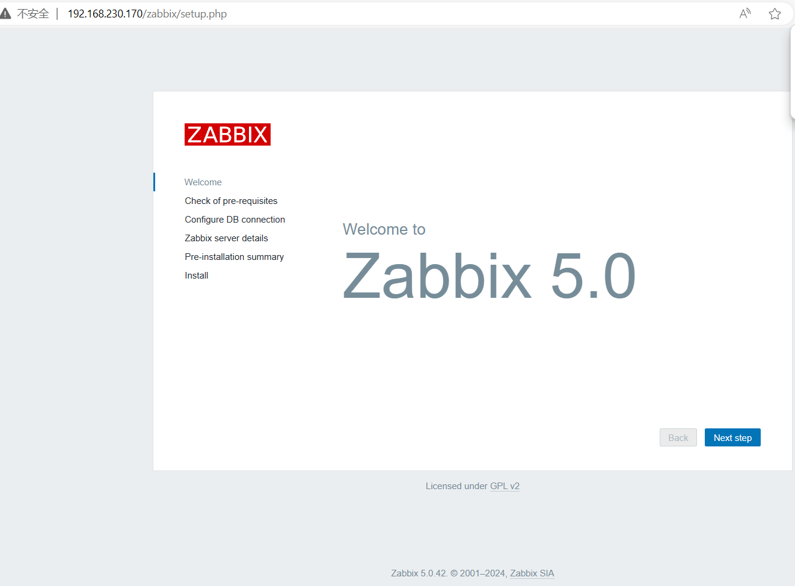
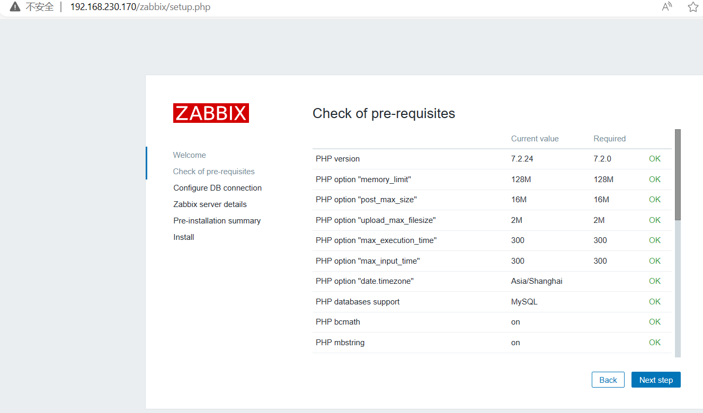
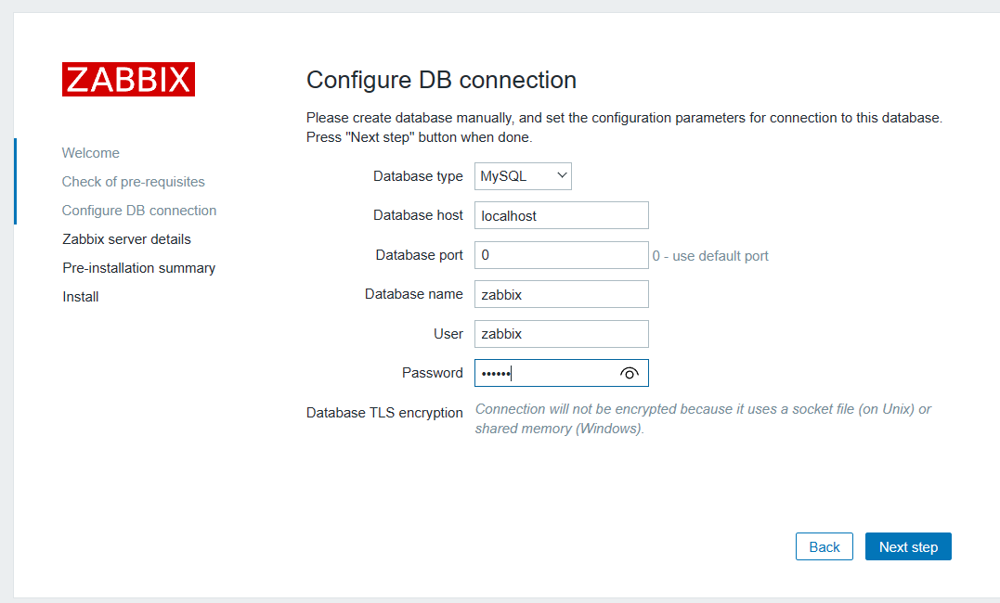
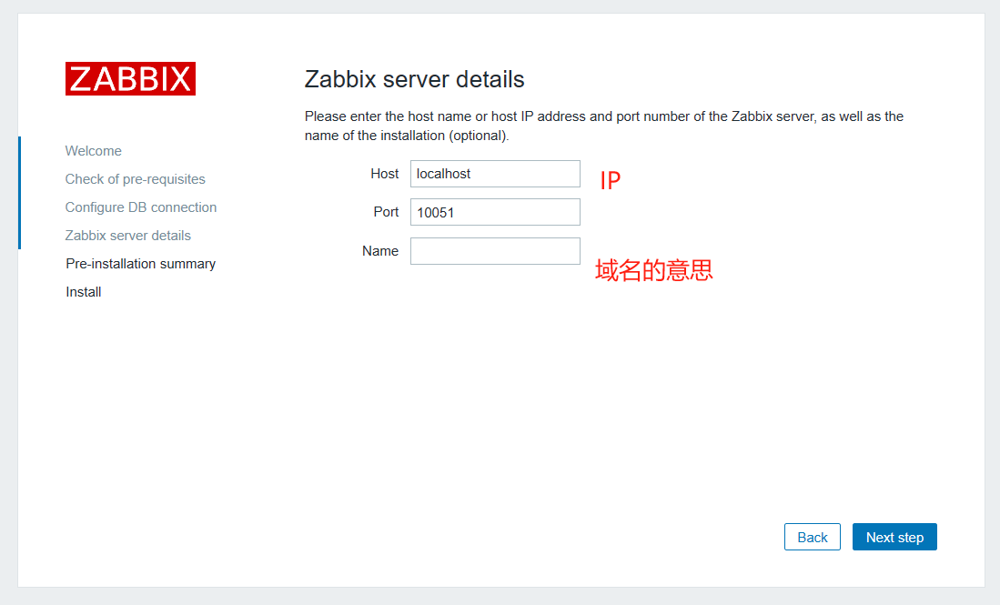
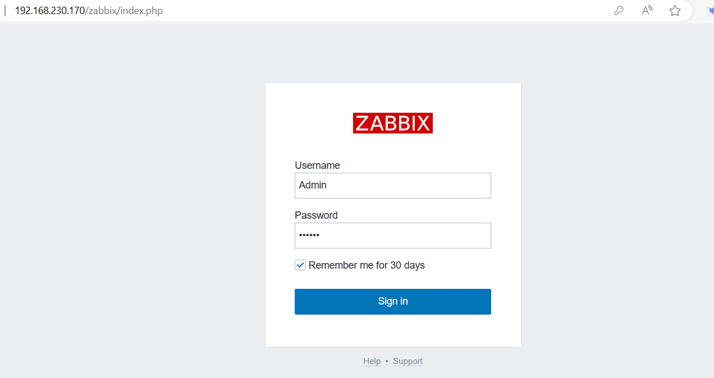
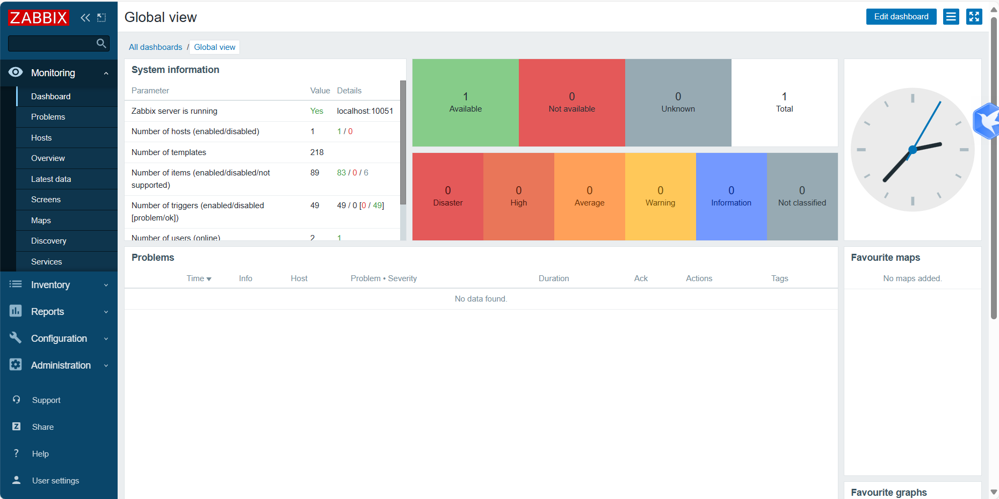
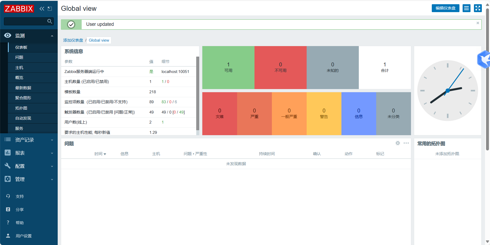

# 企业级Zabbix监控


## zabbix监控

## 1.zabbix监控框架
   server-client
   server-node-client
   server-proxy-client

普通监控


分布式监控


### zabbix优点
```
1.开源，支持二次开发，接口丰富。
2.server 对设备性能要求低，支持proxy分布式监控集中管理，有自动发现功能。
3.基于web界面的管理方式，自带多种监控模版
4.支持主被动监控模式：当监控的item比较多，服务器队列比较大时可以采用主动监控模式，被监控机客户端主动从server端去下载需要监控的item然后取数据上传到server端，这种方式对服务器负载比较小。
```

### zabbix缺点
```
需在被监控主机上安装agent，所有数据都存储在数据库里， 产生的数据很大，瓶颈主要在数据库
```
### zabbix监控系统控制对象
```
需要：agent
数据库：MySQL，MariaDB，Oracle，SQL，Server
应用软件：Nginx,Apache，PHP，Tomcat

集群：LVS,Keepalived,Haproxy,RHCS,F5
虚拟化：VMware,KVM,XEN
操作系统：Linux,Unix,Windows性能参数

需要IPMI   SNMP
硬件：服务器，存储，网络设备         ---IPMI
网络：网络环境 采集交换机，路由器的流量（内网环境，外网环境）  ---SNMP

IPMI：智能平台管理接口(Intelligent Planform Management Interface)
SNMP：网络管理协议，是专门设计用于在IP网络管理网络节点（服务器、工作站、路由器、交换机等）的一种标准协议，它是一种应用层协议
```

### 监控区别

```
Nagios 支持监控网络服务、主机、交换机、路由器等。图形不美观，对电脑性能没有要求。
https://www.nagios.com/

Cacti：监控网络，监控流量，监控是轮询监控，效率低，对电脑性能没有要求。
https://www.cacti.net/

Open-falcon 是小米开源的一款企业级、高可用的监控系统，设计用于大规模分布式系统的监控。它具有灵活的数据采集、存储、查询和展示能力，特别适合微服务架构和云计算环境。
http://open-falcon.org/

Prometheus 主动模式，go语言开发,是服务器主动给它发消息
https://prometheus.io/


Zabbix 
https://www.zabbix.com/
zabbix和nagios因为是并发监控，对CPU的要求高
zabbix在性能和功能上都强大
zabbix的图像相当漂亮
支持多种监控模式zabbix-agent   snmp等
支持分布式监控，能监控的agent非常多
zabbix有图形的web配置界面，配置简洁
zabbix支持自动发现


Grafana: 虽然Grafana本身更多地被用作一个数据可视化和仪表板工具，但它经常与Prometheus、InfluxDB等时间序列数据库结合使用，形成完整的监控解决方案。Grafana提供了高度可定制化的图表和警报功能，非常适合用于监控数据的展示和分析。


Elastic Stack (ELK): 包括Elasticsearch、Logstash、Kibana，有时还包括Beats，虽然它最初是为了日志分析而设计，但其强大的数据处理和可视化能力使其也能很好地服务于监控场景，尤其是日志监控和异常检测。
```


### Zabbix监控模式
```
被动模式
主动模式

Server
Zabbix server是agent程序报告系统可用性，系统完整性和统计数据的核心组件，是所有配置信息，统计信息和操作数据的核心存储器。

数据库存储
MySQL或者MarinaDB，关系型数据库

Web界面

proxy代理服务器
代替zabbix手机性能和可用性数据。

Agent监控代理
Zabbix agent监控代理部署在监控目标上，能够主动监控本地资源和应用程序，并将收集到的数据报告给Zabbix Server


数据流
监控方面，先创建一个主机(host)，在创建一个监控项(item)用于采集数据。
告警方面，在监控项里面创建触发器(trigger)，通过触发器(trigger)来触发告警动作(action)。
因此，如果想收集Server的CPU负载过高的告警
1.server创建一个host并关联一个用于对CPU进行监控的监控项(item)
2.创建一个Trigger，设置成当CPU负载过高时会触发
3.Trigger被处罚，发送告警邮件。


```

2.Zabbix常用术语的含义

```
主机（Host）：指需要被监控的网络设备或服务器，可以用IP地址或域名标识。

主机组（Host Group）：逻辑上组织主机的集合，便于管理和分配监控策略。

监控项（Item）：定义了从被监控主机上获取什么数据，比如CPU负载、内存使用率等。

触发器（Trigger）：基于监控项数据的逻辑表达式，用于定义问题阈值和评估监控数据，触发告警。

事件（Event）：任何需要关注的情况，如触发器状态改变，代表监控到的特定问题或状态变化。

动作（Action）：当触发器触发时执行的一系列操作，如发送通知或执行远程命令。

升级（Escalation）：在动作中定义的操作序列，用于在特定时间或条件未满足时采取更进一步的措施。

媒介（Media）：通知的方式，如电子邮件、短信或微信等。

模板（Template）：预先配置好的监控项、触发器和其他设置的集合，可应用于多个主机，简化配置。

屏幕（Screen）：自定义的监控视图，集合了多个图表和监控项，便于在Web界面查看关键指标。

地图（Map）：视觉展示监控对象及其状态，可以用图标、颜色代表不同主机或服务的健康状况。

代理（Agent）：安装在被监控主机上的软件，负责收集数据并发送至Zabbix服务器。

主动检查（Active Check）：Zabbix服务器主动发起请求，获取监控数据的方式。

被动检查（Passive Check）：监控数据由被监控端（如Zabbix agent）主动发送给Zabbix服务器的方式。
```


## 2.Zabbix企业监控系统搭建
### 1.实验准备
> centos7.5三台服务器，一台监控机，两台作为被监控节点。配置yum源，防火墙关闭，各节点时钟同步，各节点之间可以通过主机互相通信。

#### 1)所有机器关闭防火墙和selinux

```
#修改主机名
hostnamectl set-hostname server
#用于临时禁用SELinux（Security-Enhanced Linux）
setenforce 0
#永久关闭selinux
sed -i 's/SELINUX=enforcing/SELINUX=disabled/'  /etc/selinux/config
#检查selinux状态
getenforce
sestatus
#关闭防火墙
systemctl disable firewalld.service && systemctl disable firewalld.service
systemctl status firewalld.service

```
#### 2)架构图

| 主机名 | IP配置 | 服务角色 | 备注 |
| --- | --- | --- | --- |
| server | 192.168.230.170 | zabbix-server | 开启监控功能 |
| node1  | 192.168.230.171 | zabbix-node1  | 开启  | 
| node2  | 192.168.230.172 | zabbix-node2  | 开启  | 

#### 3）zabbix的安装，安装server端

同步时间
```
#查看时间
date
#三台都安装
yum -y install ntpdate
#定时时间同步，每隔5分钟同步一次
crontab -e
*/5 * * * * /usr/sbin/ntpdate ntp1.aliyun.com &>/dev/null

#检查时区
systemctl status systemd-timesyncd 
#修改为中国时区
sudo timedatectl set-timezone Asia/Shanghai
```

#### 4）更新yum源

```
#下载zabbix的yum源包，注意epel.repo和epeltesting.repo里面也有zabbix源，与官方zabbix源可能有冲突，需要注释
#rpm -Uvh 用于升级现有软件包到新版本，而rpm  -ivh 用于直接安装一个新的软件包
rpm -Uvh https://repo.zabbix.com/zabbix/5.0/rhel/7/x86_64/zabbix-release-5.0-1.el7.noarch.rpm

#更换为阿里云zabbix源
sed -i 's#http://repo.zabbix.com#https://mirrors.aliyun.com/zabbix#'  /etc/yum.repos.d/zabbix.repo

#更新yum源仓库
yum clean all  && yum repolist
```

#### 5）安装服务端

```
#安装服务端
#zabbix-server-mysql是数据库依赖
# zabbix-zgent服务端也需要监控采集自己
yum -y install zabbix-server-mysql zabbix-web-mysql zabbix-agent
#安装zabbix命令工具
yum -y install zabbix-get.x86_64
```

#### 6)设置数据库

```
#安装设置数据库
#  1.安装maria.repo
yum  install -y mariadb mariadb-server

#  2.重启数据库服务

systemctl  restart mariadb  && systemctl enable mariadb
systemctl  status mariadb 

#设置root密码
mysqladmin -u root password 'zabbix'

#创建数据库并授权账号
mysql -uroot -p'zabbix'

#创建zabbix数据库,字符集是utf8，排序也是utf8
create database zabbix character set utf8 collate utf8_bin;


#注意授权网段，本机访问，localhost，
grant all privileges on zabbix.* to 'zabbix'@'localhost' identified by 'zabbix';

#
grant all privileges on zabbix.* to 'zabbix'@'192.168.%' identified by 'zabbix';


#刷新授权 
flush privileges;

#退出
\q

```

#### 7)数据导入表中

```
#导入表
#我们直接把表导入至数据库即可   zcat指的是查看压缩文件
#mysql -uzabbix -p zabbix这里的-p是数据库的名称
[root@server ~]# ll /usr/share/doc/zabbix-server-mysql-5.0.42/
total 3260
-rw-r--r--. 1 root root      98 Mar 25 18:10 AUTHORS
-rw-r--r--. 1 root root 1255502 Mar 25 18:10 ChangeLog
-rw-r--r--. 1 root root   17990 Mar 25 18:10 COPYING
-rw-r--r--. 1 root root 2040341 Mar 25 18:12 create.sql.gz
-rw-r--r--. 1 root root     282 Mar 25 18:10 double.sql
-rw-r--r--. 1 root root      52 Mar 25 18:10 NEWS
-rw-r--r--. 1 root root    1322 Mar 25 18:10 README
[root@server ~]# zcat  /usr/share/doc/zabbix-server-mysql-5.0.42/create.sql.gz  |  mysql -uzabbix -p zabbix
Enter password: 
[root@server ~]#

```

#### 8)查看数据库

```
#登录查看数据库
[root@server ~]# mysql -u root -p 
Enter password: 
Welcome to the MariaDB monitor.  Commands end with ; or \g.
Your MariaDB connection id is 6
Server version: 5.5.68-MariaDB MariaDB Server

Copyright (c) 2000, 2018, Oracle, MariaDB Corporation Ab and others.

Type 'help;' or '\h' for help. Type '\c' to clear the current input statement.

MariaDB [(none)]> show databases;
+--------------------+
| Database           |
+--------------------+
| information_schema |
| mysql              |
| performance_schema |
| test               |
| zabbix             |
+--------------------+
5 rows in set (0.00 sec)

MariaDB [(none)]> show databases;
+--------------------+
| Database           |
+--------------------+
| information_schema |
| mysql              |
| performance_schema |
| test               |
| zabbix             |
+--------------------+
5 rows in set (0.00 sec)

MariaDB [(none)]> use zabbix;
Reading table information for completion of table and column names
You can turn off this feature to get a quicker startup with -A

Database changed
MariaDB [zabbix]> show tables;
+----------------------------+
| Tables_in_zabbix           |
+----------------------------+
| acknowledges               |
| actions                    |
| alerts                     |
| application_discovery      |
| application_prototype      |
| application_template       |
| applications               |
| auditlog                   |
| auditlog_details           |
| autoreg_host               |
| conditions                 |
| config                     |
| config_autoreg_tls         |
| corr_condition             |
| corr_condition_group       |
| corr_condition_tag         |
| corr_condition_tagpair     |
| corr_condition_tagvalue    |
| corr_operation             |
| correlation                |
| dashboard                  |
| dashboard_user             |
| dashboard_usrgrp           |
| dbversion                  |
| dchecks                    |
| dhosts                     |
| drules                     |
| dservices                  |
| escalations                |
| event_recovery             |
| event_suppress             |
| event_tag                  |
| events                     |
| expressions                |
| functions                  |
| globalmacro                |
| globalvars                 |
| graph_discovery            |
| graph_theme                |
| graphs                     |
| graphs_items               |
| group_discovery            |
| group_prototype            |
| history                    |
| history_log                |
| history_str                |
| history_text               |
| history_uint               |
| host_discovery             |
| host_inventory             |
| host_tag                   |
| hostmacro                  |
| hosts                      |
| hosts_groups               |
| hosts_templates            |
| housekeeper                |
| hstgrp                     |
| httpstep                   |
| httpstep_field             |
| httpstepitem               |
| httptest                   |
| httptest_field             |
| httptestitem               |
| icon_map                   |
| icon_mapping               |
| ids                        |
| images                     |
| interface                  |
| interface_discovery        |
| interface_snmp             |
| item_application_prototype |
| item_condition             |
| item_discovery             |
| item_preproc               |
| item_rtdata                |
| items                      |
| items_applications         |
| lld_macro_path             |
| lld_override               |
| lld_override_condition     |
| lld_override_opdiscover    |
| lld_override_operation     |
| lld_override_ophistory     |
| lld_override_opinventory   |
| lld_override_opperiod      |
| lld_override_opseverity    |
| lld_override_opstatus      |
| lld_override_optag         |
| lld_override_optemplate    |
| lld_override_optrends      |
| maintenance_tag            |
| maintenances               |
| maintenances_groups        |
| maintenances_hosts         |
| maintenances_windows       |
| mappings                   |
| media                      |
| media_type                 |
| media_type_message         |
| media_type_param           |
| module                     |
| opcommand                  |
| opcommand_grp              |
| opcommand_hst              |
| opconditions               |
| operations                 |
| opgroup                    |
| opinventory                |
| opmessage                  |
| opmessage_grp              |
| opmessage_usr              |
| optemplate                 |
| problem                    |
| problem_tag                |
| profiles                   |
| proxy_autoreg_host         |
| proxy_dhistory             |
| proxy_history              |
| regexps                    |
| rights                     |
| screen_user                |
| screen_usrgrp              |
| screens                    |
| screens_items              |
| scripts                    |
| service_alarms             |
| services                   |
| services_links             |
| services_times             |
| sessions                   |
| slides                     |
| slideshow_user             |
| slideshow_usrgrp           |
| slideshows                 |
| sysmap_element_trigger     |
| sysmap_element_url         |
| sysmap_shape               |
| sysmap_url                 |
| sysmap_user                |
| sysmap_usrgrp              |
| sysmaps                    |
| sysmaps_elements           |
| sysmaps_link_triggers      |
| sysmaps_links              |
| tag_filter                 |
| task                       |
| task_acknowledge           |
| task_check_now             |
| task_close_problem         |
| task_data                  |
| task_remote_command        |
| task_remote_command_result |
| task_result                |
| timeperiods                |
| trends                     |
| trends_uint                |
| trigger_depends            |
| trigger_discovery          |
| trigger_tag                |
| triggers                   |
| users                      |
| users_groups               |
| usrgrp                     |
| valuemaps                  |
| widget                     |
| widget_field               |
+----------------------------+


```

### 2.配置server端

> 数据库准备就绪，修改server端的配置文件

```
[root@server ~]# cd /etc/zabbix/
[root@server zabbix]# ls
zabbix_server.conf
[root@server zabbix]# cp zabbix_server.conf zabbix_server.conf.bak
[root@server zabbix]# vi zabbix_server.conf
DBHost=localhost
DBName=zabbix
DBUser=zabbix
DBPassword=zabbix

#查看下修改的参数
cat zabbix_server.conf | egrep "DBHost|DBUser|DBName|DBPassword"

#开启服务
[root@server zabbix]# systemctl start zabbix-server
[root@server zabbix]# systemctl enable zabbix-server
Created symlink from /etc/systemd/system/multi-user.target.wants/zabbix-server.service to /usr/lib/systemd/system/zabbix-server.service.


安装netstat工具
yum install net-tools -y
[root@server zabbix]# netstat -tunlp | grep 10051
?tcp        0      0 0.0.0.0:10051           0.0.0.0:*               LISTEN      10471/zabbix_server 
tcp6       0      0 :::10051                :::*                    LISTEN      10471/zabbix_server 

```

### 3.配置web GUI
```
# 1.启动zabbix前端，修改yum源
vim  /etc/yum.repos.d/zabbix.repo
[zabbix-frontend]下的enabled修改为1

#安装Software Collections，便于安装php
[root@server ~]# yum -y install centos-release-scl 


#安装zabbix前端和相关=环境
yum -y install zabbix-web-mysql-scl zabbix-apache-conf-scl


```

### 4.为zabbix前端配置PHP
```
vi /etc/opt/rh/rh-php72/php-fpm.d/zabbix.conf

[zabbix]
user = apache
group = apache

listen = /var/opt/rh/rh-php72/run/php-fpm/zabbix.sock
listen.acl_users = apache
listen.allowed_clients = 127.0.0.1

pm = dynamic
pm.max_children = 50
pm.start_servers = 5
pm.min_spare_servers = 5
pm.max_spare_servers = 35
pm.max_requests = 200

php_value[session.save_handler] = files
php_value[session.save_path]    = /var/opt/rh/rh-php72/lib/php/session/

php_value[max_execution_time] = 300
php_value[memory_limit] = 128M
php_value[post_max_size] = 16M
php_value[upload_max_filesize] = 2M
php_value[max_input_time] = 300
php_value[max_input_vars] = 10000
#下面的分号代表注释
; php_value[date.timezone] = Europe/Riga
#添加下面一行内容
php_value[date.timezone] = Asia/Shanghai

```

### 5.启动httpd服务

```
systemctl restart zabbix-server zabbix-agent httpd rh-php72-php-fpm
systemctl enable zabboix-server zabbix-agent httpd rh-php72-php-fpm


[root@server ~]# systemctl restart zabbix-server zabbix-agent httpd rh-php72-php-fpm
[root@server ~]# systemctl enable zabbix-server zabbix-agent httpd rh-php72-php-fpm
Created symlink from /etc/systemd/system/multi-user.target.wants/zabbix-agent.service to /usr/lib/systemd/system/zabbix-agent.service.
Created symlink from /etc/systemd/system/multi-user.target.wants/httpd.service to /usr/lib/systemd/system/httpd.service.
Created symlink from /etc/systemd/system/multi-user.target.wants/rh-php72-php-fpm.service to /usr/lib/systemd/system/rh-php72-php-fpm.service.


#zabbix服务端10051   客户端10050
[root@server ~]# netstat -lntp | egrep "80|10051|10050"
tcp        0      0 0.0.0.0:10050           0.0.0.0:*               LISTEN      10960/zabbix_agentd 
tcp        0      0 0.0.0.0:10051           0.0.0.0:*               LISTEN      10972/zabbix_server 
tcp6       0      0 :::80                   :::*                    LISTEN      11057/httpd         
tcp6       0      0 :::10050                :::*                    LISTEN      10960/zabbix_agentd 
tcp6       0      0 :::10051                :::*                    LISTEN      10972/zabbix_server 
[root@server ~]# netstat -tunlp
Active Internet connections (only servers)
Proto Recv-Q Send-Q Local Address           Foreign Address         State       PID/Program name    
tcp        0      0 0.0.0.0:22              0.0.0.0:*               LISTEN      1071/sshd           
tcp        0      0 127.0.0.1:25            0.0.0.0:*               LISTEN      1314/master         
tcp        0      0 0.0.0.0:10050           0.0.0.0:*               LISTEN      10960/zabbix_agentd 
tcp        0      0 0.0.0.0:10051           0.0.0.0:*               LISTEN      10972/zabbix_server 
tcp        0      0 127.0.0.1:9000          0.0.0.0:*               LISTEN      10970/php-fpm: mast 
tcp        0      0 0.0.0.0:3306            0.0.0.0:*               LISTEN      10281/mysqld        
tcp6       0      0 :::80                   :::*                    LISTEN      11057/httpd         
tcp6       0      0 :::22                   :::*                    LISTEN      1071/sshd           
tcp6       0      0 ::1:25                  :::*                    LISTEN      1314/master         
tcp6       0      0 :::10050                :::*                    LISTEN      10960/zabbix_agentd 
tcp6       0      0 :::10051                :::*                    LISTEN      10972/zabbix_server 
udp        0      0 0.0.0.0:68              0.0.0.0:*                           880/dhclient        
udp        0      0 127.0.0.1:323           0.0.0.0:*                           698/chronyd         
udp6       0      0 ::1:323                 :::*                                698/chronyd         
[root@server ~]# 


```

### 浏览器访问并进行初始化
>  http://192.168.230.170/zabbix



#### 检查环境语言



数据库设置，这里端口0代表的就是3306，如果更改为其他就换一下即可


#### 设置域名IP等



#### 保持默认


#### 登录 用户名Admin  密码zabbix




#### 设置中文-左下角-User settings-language-设置中文即可



## 客户端配置

### 1）安装zabbix

```
#下载zabbix的yum源包，注意epel.repo和epeltesting.repo里面也有zabbix源，与官方zabbix源可能有冲突，需要注释
#rpm -Uvh 用于升级现有软件包到新版本，而rpm  -ivh 用于直接安装一个新的软件包
rpm -Uvh https://repo.zabbix.com/zabbix/5.0/rhel/7/x86_64/zabbix-release-5.0-1.el7.noarch.rpm

#更换为阿里云zabbix源
sed -i 's#http://repo.zabbix.com#https://mirrors.aliyun.com/zabbix#'  /etc/yum.repos.d/zabbix.repo

#更新yum源仓库
yum clean all  && yum repolist

#安装软件
yum -y install zabbix-agent zabbix-sender -y
```

### 2)修改配置文件

```
[root@node1 ~]# cd /etc/zabbix/
[root@node1 zabbix]# ll
total 16
-rw-r--r--. 1 root root 15991 Mar 25 18:20 zabbix_agentd.conf
drwxr-xr-x. 2 root root     6 Mar 25 18:20 zabbix_agentd.d

#备份
[root@node1 zabbix]# cp zabbix_agentd.conf{,.bak}

vi 
Server=192.168.230.170  #zabbix服务器地址
ServerActive=192.168.230.170  #主动模式，zabbix-server-ip
Hostname=node1_192.168.230.171   #此台的标记名
UnsafeUserParameters=1 #是否限制用户自定义keys使用特殊字符1是可以启用特殊字符 0是不可以启用特殊字符
```

### 3）查看配置文件

```
[root@node1 ~]# cat /etc/zabbix/zabbix_agentd.conf | egrep "Server|ServerActive|Hostname|UnsafeUserParameters"
### Option: Server
#	Example: Server=127.0.0.1,192.168.1.0/24,::1,2001:db8::/32,zabbix.example.com
# Server=
Server=192.168.230.170
### Option: ServerActive
#	Server/proxy address is IP address or DNS name and optional port separated by colon.
#	Example: ServerActive=127.0.0.1:20051,zabbix.example.com,[::1]:30051,::1,[12fc::1]
# ServerActive=
ServerActive=192.168.230.170
### Option: Hostname
#	Value is acquired from HostnameItem if undefined.
# Hostname=
Hostname=node1_192.168.230.171
### Option: HostnameItem
#	Item used for generating Hostname if it is undefined. Ignored if Hostname is defined.
# HostnameItem=system.hostname
#	all collected data to Zabbix Server or Proxy if the buffer is full.
#	Maximum number of new lines the agent will send per second to Zabbix Server
#	Aliases can be used in HostMetadataItem but not in HostnameItem parameters.
### Option: UnsafeUserParameters
UnsafeUserParameters=1
### Option: TLSServerCertIssuer
# TLSServerCertIssuer=
### Option: TLSServerCertSubject
# TLSServerCertSubject=
[root@node1 ~]# 
```

### 4)开启服务

```
[root@node1 ~]# systemctl start zabbix-agent
[root@node1 ~]# systemctl enabl zabbix-agent
Unknown operation 'enabl'.
[root@node1 ~]# netstat -tunlp | grep 10050
tcp        0      0 0.0.0.0:10050           0.0.0.0:*               LISTEN      10067/zabbix_agentd 
tcp6       0      0 :::10050                :::*                    LISTEN      10067/zabbix_agentd 
[root@node1 ~]#
```


### 5）在服务端检查日志，查看是否启动（node1的IP为192.168.230.171）
```
[root@server zabbix]# tail -f zabbix_server.log 
 11034:20240501:142347.264 server #36 started [icmp pinger #1]
 11035:20240501:142347.264 server #37 started [alert syncer #1]
 11027:20240501:142439.297 enabling Zabbix agent checks on host "Zabbix server": host became available
 11012:20240501:144229.755 item "Zabbix server:vfs.dev.read.await[sda]" became not supported: Cannot evaluate expression: "Cannot evaluate function "last()": not enough data.".
 11010:20240501:144230.756 item "Zabbix server:vfs.dev.write.await[sda]" became not supported: Cannot evaluate expression: "Cannot evaluate function "last()": not enough data.".
 11010:20240501:145230.281 item "Zabbix server:vfs.dev.read.await[sda]" became supported
 11012:20240501:145231.281 item "Zabbix server:vfs.dev.write.await[sda]" became supported
 11005:20240501:145348.112 executing housekeeper
 11005:20240501:145348.122 housekeeper [deleted 0 hist/trends, 0 items/triggers, 0 events, 0 problems, 0 sessions, 0 alarms, 0 audit, 0 records in 0.009013 sec, idle for 1 hour(s)]

 # 只是安装了，没有配置，所有提示没有发现
 11032:20240501:152922.718 cannot send list of active checks to "192.168.230.171": host [node1_192.168.230.171] not found

```
